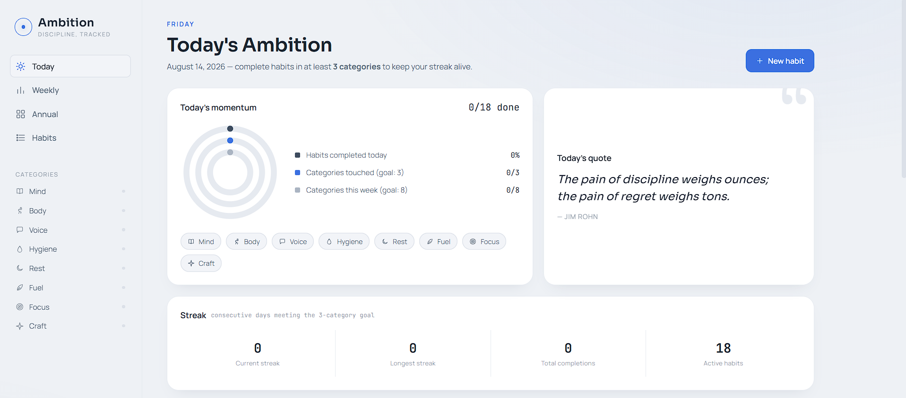
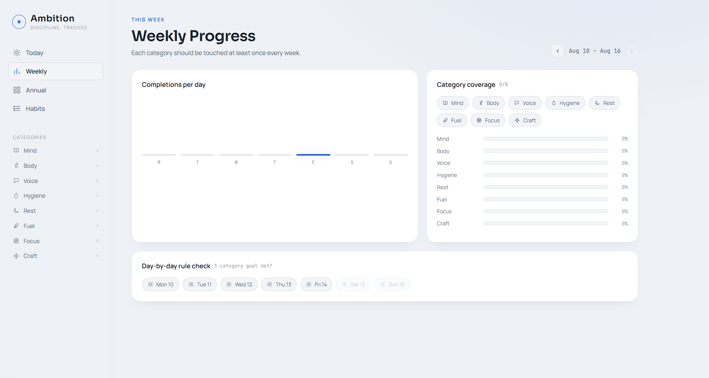
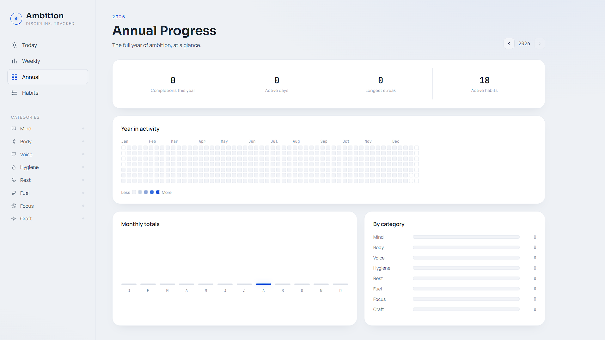
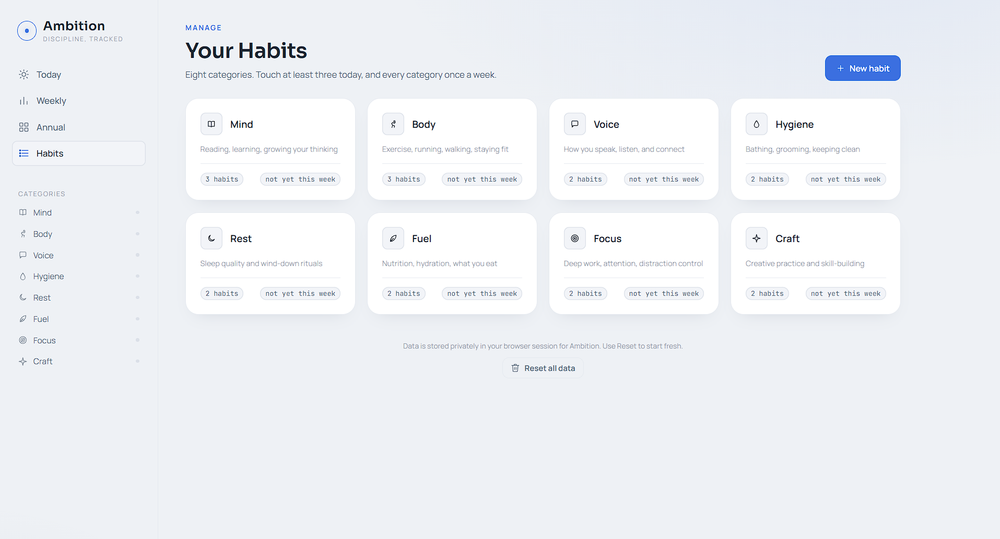

# Ambition — Habit Tracker

A habit tracker with daily, weekly, and annual dashboards, built around one core rule: **touch at least 3 categories a day, and every category at least once a week.**
---
## 🌐 Live Demo

🔗 **Try the application here:**

**https://ambition-rajdevelopment.vercel.app/**

> Experience the app directly in your browser—no installation required.
---
## 📸 Preview

---

## Pages

The app uses hash-based routing (`#/today`, `#/weekly`, ...) so it behaves like a real multi-page product with back/forward history, all from one file.

| Page | What it shows |
|---|---|
| **Today** | Concentric ring chart (today's completion %, categories touched toward your 3/day goal, weekly category coverage), current streak stats, today's quote, and your due-today habit list grouped by category |
| **Weekly** | Bar chart of completions per day, per-category completion rates, and a day-by-day check of whether the 3-category rule was met |
| **Annual** | GitHub-style year heatmap, monthly totals bar chart, and completions broken down by category |
| **Habits** | Overview of all 8 categories with habit counts and weekly status — click into any category to manage its habits |
| **Category** (per category) | Stats and full habit list for that one category, with inline add/edit/delete |

---

## Categories

Eight fixed categories, chosen to cover a well-rounded set of daily disciplines:

1. **Mind** — reading, learning, growing your thinking
2. **Body** — exercise, running, walking, staying fit
3. **Voice** — how you speak, listen, and connect
4. **Hygiene** — bathing, grooming, keeping clean
5. **Rest** — sleep quality and wind-down rituals
6. **Fuel** — nutrition, hydration, what you eat
7. **Focus** — deep work, attention, distraction control
8. **Craft** — creative practice and skill-building

## The 3-category rule

A day counts toward your streak only when you've completed at least one habit in **3 different categories**. The app also tracks whether each of the 8 categories has been touched at least once in the current week, shown as a coverage grid on the Weekly page and as small dots next to each category in the sidebar.

## Habit frequency types

When adding or editing a habit, choose from:

- **Every day**
- **Specific days of the week** (e.g. Mon / Wed / Fri)
- **Only one day** (a single fixed date)
- **A few times a week / month / year** (a target count per period, e.g. "3x / week")

Each habit shows its own streak — calculated appropriately for its frequency type (consecutive days, consecutive scheduled days, or consecutive periods where the target was hit).

## Streaks & quotes

- **Overall streak** — consecutive days the 3-category rule was met, shown in the sidebar and on the Today dashboard, along with your longest-ever streak.
- **Daily quote** — a new quote each day, deterministically picked from a rotating list so it's the same all day and different tomorrow.

---

## Design

- **Palette:** white and light-grey surfaces with a single blue accent — no color overload, but not empty either.
- **Type:** Sora for headings, Manrope for body text, JetBrains Mono for stats and numbers.
- **Charts:** hand-built SVG — concentric progress rings, bar charts, horizontal category bars, and a GitHub-style year heatmap.

## Data & storage

All habits and completions are saved automatically using the app's built-in persistent storage, tied to your session — nothing is sent to a server, and nothing is public. Use **Reset all data** at the bottom of the Habits page if you want to start over from the default habit set.

## Tech

Plain HTML, CSS, and vanilla JavaScript — no frameworks, no build tools, no external dependencies aside from Google Fonts.
